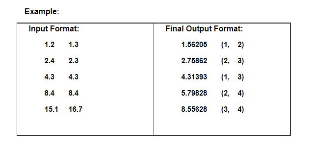

# Using MPI to Parallelize an All-Pairs Problem
You are given a table T consisting of two attributes, x and y. The table is stored as n tuples of x and y in a file. The values inside a tuple are separated by a tab character; each tuple ends with a new line character (therefore a tuple is a line).

 

Based on a given file, you are asked to write an MPI program to calculate the distance of each pair of (x,y), and then find the top 5 shortest distances and their corresponding pairs.

 

Your program must be able to

1. Get the correct result
2. Create 1-4 processes to do computation in parallel (show your scalability in your report)



## How to run? 
```
make input_generation  //Produce input file:input.txt
make run //Recompile and run
```